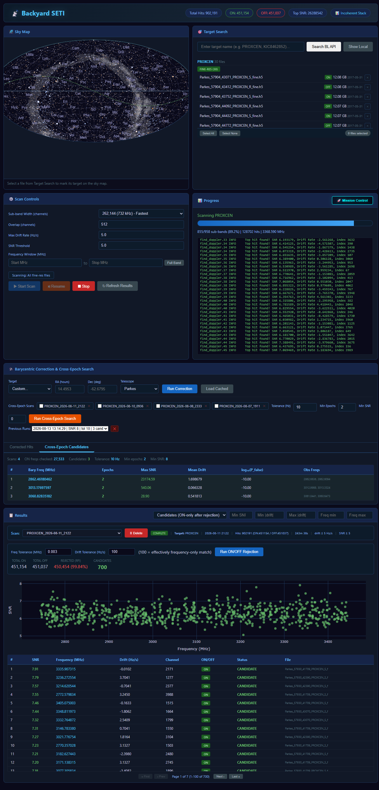
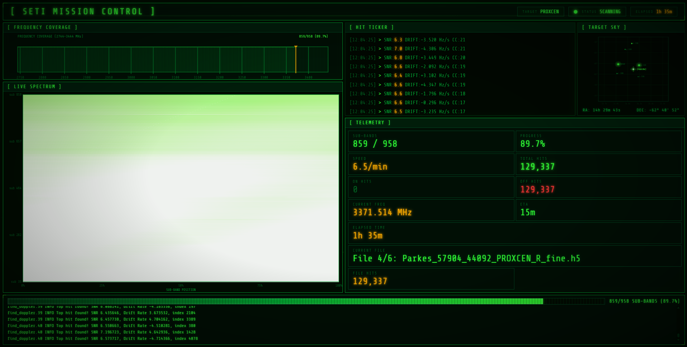
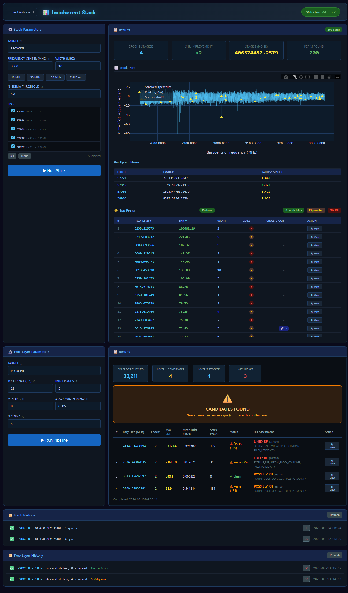

# Backyard SETI

Amateur analysis of Breakthrough Listen open radio telescope data for SETI signal detection.

## Overview

This project works with the Breakthrough Listen (BL) open data archive to search for narrowband signals of potential intelligent origin. We use Berkeley's open-source tools (blimpy, turbo_seti) alongside custom analysis pipelines for:

- **Targeted star searches** - Doppler drift analysis on specific stars (Proxima Centauri, TRAPPIST-1, etc.)
- **RFI rejection** - On/off cadence comparison to reject terrestrial interference
- **Cross-epoch correlation** - Barycentric frequency matching across multiple observation epochs
- **Incoherent stacking** - Power spectrum averaging across epochs to detect sub-threshold signals
- **Anomaly detection** - Spectral outlier identification in archived observations
- **Bulk analysis** - Systematic processing of archived data for unusual signals

## Tools

| Tool | Purpose |
|------|---------|
| [blimpy](https://github.com/UCBerkeleySETI/blimpy) | Load and visualize filterbank/HDF5 files |
| [turbo_seti](https://github.com/UCBerkeleySETI/turbo_seti) | Narrowband Doppler drift search |
| [astropy](https://www.astropy.org/) | Barycentric velocity correction |
| Custom scripts | RFI rejection, batch processing, cross-epoch search, incoherent stacking |
| SQLite | Indexed hit storage, cross-epoch search, stack job persistence, result caching |
| Flask | Dashboard web UI |

## Data Sources

- **Portal:** [Breakthrough Listen Open Data Archive](https://breakthroughinitiatives.org/opendatasearch)
- **Formats:** HDF5 (.h5) fine-res and mid-res
- **Telescopes:** Parkes (Australia), GBT (Green Bank, WV)
- **Sizes:** ~12 GB per Parkes fine-res file, ~3.8 GB per GBT sub-band file
- **Primary targets:** Any BL target with fine-res cadence data, discovered via the BL Catalog (PROXCEN scanned; survey shortlist building). Proxima Centauri remains the validation testbed with 6 epochs archived.

## Downloading Observation Epochs (read this first)

BL data comes from two telescopes with **completely different filename
grammars, cadence conventions, and download strategies**. None of this is
intuitive from the archive web page; this section is the decoder ring.

All of it is built into the dashboard: search, cadence/session browsing,
band selection, and downloads are all buttons. This section explains what
you are actually looking at, because BL documents none of it. Once your
first epoch is on disk, continue with **End-to-End: From Download to
Stacked Epochs** below. CLI equivalents for everything here live in the
**CLI Reference** section at the bottom of this README.

**One API, two grammars.** Every file is reached through the same query
(`api/query-files?target=NAME`), but what you get back and what an
"observation" even means differs by telescope:

### Parkes: explicit ON/OFF cadences

```
Parkes_57791_72989_PROXCEN_S_fine.h5
└─Telescope └MJD └SEQ └TARGET └┬┘ └fine = resolution
                          S = ON, R = OFF
```

- Parkes observes **ABABAB**: your target (S) alternates with a fixed blank-sky
  offset position (R). Files with consecutive sequence numbers from the same
  MJD, alternating S/R, form one **cadence set** (typically 3 ON + 3 OFF).
- One cadence set = one **epoch**. ~12.4 GB per file, ~75 GB per epoch.
- RFI rejection: a signal present in both S and R files is terrestrial.
- The `_S`/`_R` marker is **optional** in the filename (bare forms like
  `Parkes_57770_78921_ALPHACEN_fine.h5` exist); a missing marker means the
  position must be inferred from sequence order or the observing log.

**Downloading from the dashboard:** type the target name (e.g. `PROXCEN`)
in Target Search and hit **Search BL API**. Filter to Fine resolution and
download the S/R file set that shares one MJD (consecutive sequence
numbers), typically 3 ON + 3 OFF, ~75 GB per epoch. Files land in
`data/fine/` with live progress in the Downloads panel.

### GBT: no ON/OFF files at all, ABACAD companion cadences instead

```
blc00_guppi_59433_42615_HIP29806_0041.rawspec.0000.h5
└compute node └─┬┘ └MJD └SEQ └TARGET  └scan └┬─┘ └tier: 0000 = fine-res
              product type                  (rawspec = Berkeley hi-res)
```

GBT never writes blank-sky OFF files. Instead the observing session
interleaves your target (A) with **other nearby targets** (B, C, D) in an
ABACAD pattern. Those companion scans are the RFI reference: a signal in
your target AND in a companion is local to the telescope. There is no
marker in the filename; companions are found by looking at which other
targets have sequence numbers adjacent to yours in the same session MJD.

Each GBT scan is split across ~26 compute nodes, one 187.5 MHz sub-band file
each (~3.8 GB), together covering 1.1-11.9 GHz (~100 GB per scan). You can
**cherry-pick sub-bands**: L-band (1.1-2.0 GHz) is typically 4-6 files per
scan depending on how many nodes were recording that session (MJD 58832
had 6: blc71-76 at centers 1033/1220/1408/1595/1783/1970 MHz), selected by
the API's `center_freq` field. File-count arithmetic: scans x nodes = files
(3 A-scans x 6 nodes = 18 target files for a 58832-style session).
For serious RFI work include the companion scans' same sub-bands too.

**Bands differ between epochs - check before planning cross-epoch.** BL
swaps GBT receivers between sessions, so epochs of the same target are
usually in entirely different bands. MESSIER031: X (7.8-11.2 GHz),
L (1.1-2.0), S (2.4 spliced), C (4.0-8.2) across its four epochs - zero
shared coverage, so cross-epoch matching cannot produce candidates and the
analysis value is within-epoch (A-scans vs ABACAD companions, OFF-control
mode). Parkes epochs of a target share the same band, which is why
cross-epoch works there. Before expecting cross-epoch hits from a GBT
target, compare each session's center_freq list (dashboard session browser
shows in-band counts per band selection).

**Downloading from the dashboard:** search the target (e.g. `GJ447` for
Ross 128). When the results contain GBT files, a **"GBT data detected"**
banner appears: click **Browse GBT Sessions**. You get one row per
observation session (MJD) showing fine file counts, in-band file count and
GB for the selected band (L/S/C/X dropdown), and the ABACAD companions
found for that session. Check **+ companions** to include the OFF scans,
then click a session's **Download** button: every in-band fine file is
queued into the standard Downloads panel with progress and cancel. Repeat
for each session you want as an epoch.

**How companions are found (proximity method).** The BL API has no
"what else was observed this session" endpoint, so the session browser
discovers ABACAD companions itself: it takes the nearest targets on the
sky to yours (within 10 deg, coordinates from the BL Catalog sweep), asks
each directly whether it has files in your session's MJD, and keeps the
ones whose sequence numbers interleave with your target's scans. BL
schedules its B/C/D positions a few degrees from the primary, so this
finds them reliably - even when they share no name prefix with your
target (Ross 128 = GJ447 has HIP56376/HIP56378/HIP56445 companions in one
session and HIP56677/HIP56682/HIP56691 in the other). If the catalog is
unswept, discovery falls back to prefix-response neighbors and the table
notes which method produced the results (`companion_source`).
Cross-epoch matching remains the primary RFI filter either way.

### The prefix-match trap (applies to EVERYTHING)

The BL API **prefix-matches** `?target=` against every name: querying `HIP2`
returns HIP2 plus HIP225, HIP26, HIP29806, and 608 others (9,525 files, of
which exactly 10 are HIP2). Querying `GJ1` returns zero GJ1 files and 1,367
files belonging to GJ15B, GJ1002, GJ1245ac... Always filter results by the
target token **parsed from the filename itself**. Every tool in this repo
(`bl_search.py`, `download_gbt.py`, the catalog sweep) does this
automatically; if you write your own query code, you must too. Short names
are the dangerous ones: HIP2, GJ1, HIP26 all collide. Long unique names
(PROXCEN, NGC1426) are unaffected.

## End-to-End: From Download to Stacked Epochs

Follow this walkthrough with any target and you end with RFI-filtered,
barycentric-corrected, cross-epoch-validated epochs and an incoherent
stack plot. Every step is a dashboard button; no terminal needed. Times
assume default scan settings (262,144 sub-band width).

### 0. Register the target (once)

The barycentric panel and stack page draw their target dropdowns from the
Target Registry. Add your target first: type the name in the Target
Registry box and click **Add** (coordinates resolve via SIMBAD), or click
**Add to Registry** on any BL Catalog row. Aliases are fine, "Ross 128"
resolves to the same place as GJ447.

### Track A: Parkes (explicit ON/OFF cadence)

1. **Download one epoch.** Search the target, filter to Fine, download the
   S and R files sharing one MJD (3 ON + 3 OFF, ~75 GB). See "Downloading
   Observation Epochs" for the cadence mechanics.
2. **Audit the epoch (RFI zone map) - before scanning.** With the target
   name still in the Target Search box, type the epoch's MJD (the 5-digit
   number in the filenames, e.g. `58058`) into the Epoch Audit box and
   click **Audit Epoch**. The audit slides 4 MHz windows across the whole
   band, measures each ON-OFF residual against the epoch's own noise
   floor, and auto-writes persistent RFI zones (only where 2+ ON/OFF
   pairs agree) to `data/rfi_zones.json`. Takes a few minutes and needs
   only the downloaded files. Audit BEFORE the scan so the zones exist
   when hits are imported: hits inside zones get their `rfi_zoned` flag
   at insert time and every later stage (rejection, stack, cross-epoch)
   ignores them automatically - no backfill pass needed. "CLEAN" means
   no zones found. **Parkes only** - this tool needs blank-sky OFF pairs.
3. **Scan.** The cadence appears in Local Data. Select its files and click
   **Start Scan**. Expect roughly 21 hours for a 6-file cadence at default
   settings. Interrupted scans resume from where they stopped, and Mission
   Control shows live progress. Hits land in the database automatically.
4. **Reject RFI.** In the Results panel, select the scan, leave Freq
   Tolerance 0.003 MHz and Drift Tolerance 100, click **Run ON/OFF
   Rejection**. Signals present in both ON and OFF frames are terrestrial
   and get flagged.
5. **Repeat** steps 1-4 for every epoch you want, then **Archive Epoch to
   D:** each finished cadence to free SSD staging space (the data stays
   reachable from the archive).

### Track B: GBT (ABACAD sessions)

1. **Download sessions with companions.** Search the target (e.g. GJ447),
   click **Browse GBT Sessions** in the banner, pick a band (L recommended:
   ~15 GB per session), **check + companions**, and click **Download** on
   each session row. The companions are the whole point: they are the OFF
   scans that make the rest of the pipeline work. Two sessions minimum;
   more epochs means stronger cross-epoch rejection.
2. **Scan.** Same as Parkes: expand the target's group in Local Data (the
   companion files sit in their own groups), select your scans AND the
   companion scans, and **Start Scan**. Whole-band GBT files run ~4-5
   hours each at defaults. During import, hits from your scans are
   classified ON and companion hits OFF (the importer matches each file's
   target token against the scan's target - the ABACAD A/B/C/D logic).
3. **Reject RFI.** Same button as Parkes: select the scan, leave the
   defaults, **Run ON/OFF Rejection**. Signals present in both your scans
   and companion scans are local to the telescope and get flagged.
   Companion OFFs are different stars a few degrees away rather than blank
   sky, so a genuine signal from YOUR target appears in your scans only.
   The one Parkes-only step: **Epoch Audit** (it derives its noise floor
   from blank-sky ON/OFF residuals; skip it for GBT).

## RFI Zones

Persistent, known-bad frequency ranges that the pipeline masks automatically.
Zones live in `data/rfi_zones.json` and come in two scopes:

- **Telescope/band zones** (e.g. `gbt/L`) - persistent site emitters that
  appear in EVERY epoch from that telescope and band (radar, satellite
  downlinks, instrument birdies like the UPCS emitter at 1921.4 MHz).
  Write once, protected forever.
- **Epoch zones** (e.g. `57532`, an MJD) - junk specific to one observing
  session, like a one-off gain plateau.

Every consumer honors both scopes automatically: the incoherent stack masks
zoned bins (they vote NaN), the fine-res pipeline skips fully-zoned
sub-bands, DB import flags hits inside zones (`rfi_zoned=1`), and stack
peak classification demotes zoned peaks to RFI before scoring. The scope
is derived from the source filename (the blc node digits in GBT filenames
encode the band), so nothing needs to be set per run.

**Managing zones (Stack page):** the RFI Zones panel on the left of
`/stack` lists every zone with its scope color-coded (orange =
telelescope/band, blue = single epoch; hover a row for its reason).
Add zones with the form (scope + frequency range + reason, all required),
delete with the ✕ button.

**Click-drag zoning:** on any rendered stack plot, drag a box across the
frequency range you want zoned. A dialog appears with the range prefilled;
pick a scope (band scopes plus the currently loaded epochs), type a reason,
click **+ Zone It**. Exit box-select mode via the modebar's zoom/pan icons
or double-click the plot.

**Automatic zoning (Parkes only):** the Epoch Audit (see Track A step 2)
auto-writes epoch zones for unambiguous ON/OFF excursions. GBT epochs rely
on manual zones and the telescope/band layer.

Note: stack-plot frequencies are barycentric while zones apply in the
observed frame; the difference (~150 kHz at typical GBT velocities) is
negligible for narrow zones.

### Shared finishing steps (both tracks)

4. **Barycentric correction.** In the Barycentric panel pick the target
   (RA/Dec auto-fill from the registry), set **Telescope** to Parkes or
   GBT to match your data, and click **Run Correction** for each scan.
   This shifts hit frequencies into the solar-system barycenter frame so a
   real transmitter holds still across epochs; uncorrected, Earth's
   orbital motion smears a genuine signal by 36-115 kHz between sessions
   (measured on NGC1426's epoch spacing).
5. **Cross-epoch search.** Tick 2+ corrected scans, keep Tolerance 10 Hz
   and Min Epochs 2 (raise to 3 when you have many epochs), optionally set
   Min SNR 10, and click **Run Cross-Epoch Search**. Candidates show the
   same barycentric frequency in multiple epochs: RFI cannot hold that
   frame, so this is the strongest automated filter in the pipeline.
   Anything surviving deserves a manual waterfall look (click the hit).
6. **Stack.** Open the Stack page (`http://localhost:8070/stack`), pick the
   target, a center frequency and window width, select epochs (All), leave
   N-sigma at 5, and run. Stacking averages N epochs of power: a signal at
   SNR 1.5 in single epochs rises to ~SNR 6.7 with 20 epochs. The result
   badge reports the measured improvement and the peak table lists
   detections at your sigma threshold.

## Project Structure

```
backyard-seti/
├── src/                    # Analysis scripts + SQLite database layer (db.py)
│   ├── db.py               # SQLite schema, hit CRUD, cross-epoch, stack jobs
│   ├── barycentric_correct.py  # Barycentric velocity correction + cross-epoch matching
│   ├── fine_res_pipeline.py    # turboSETI batch runner with sub-band chunking
│   ├── target_registry.py     # Phase 3A: SQLite target registry (SIMBAD, BL availability)
│   ├── bl_catalog.py          # BL catalog sweep/cache (open browse of every target)
│   ├── bl_search.py        # BL API search/download
│   └── download_proxima.py # Batch downloader for PROXCEN cadences
├── data/                   # Downloaded BL files + seti_hits.db (gitignored)
│   ├── fine/               # Fine-res HDF5 files (12 GB each)
│   ├── stack_results/      # Incoherent stack output (plots, JSON, SQLite)
│   └── seti_hits.db        # SQLite: hits, scans, cross_epoch_results, stack_jobs
├── results/                # Scan outputs, barycentric corrections, cross-epoch cache
├── dashboard/              # Flask web UI
│   ├── app.py              # Backend: scan control, hit API, cross-epoch, stack endpoints
│   ├── templates/          # index.html (main), stack.html (incoherent stack), mission.html
│   ├── static/js/          # dashboard.js, stack.js, mission.js, skymap.js
│   └── static/css/         # style.css, stack.css, mission.css
├── incoherent_stack.py     # Phase 2C: incoherent power spectrum stacking
├── docs/                   # Documentation and roadmap
│   └── ROADMAP.md          # Full project roadmap with phase progression
├── README.md
└── .gitignore
```

## Pipeline Architecture

### Phase 1: Pipeline Validation (COMPLETE)

1. **Signal Injection and Recovery** - Verified turboSETI detects synthetic signals
   on fine-res data. Confirmed mid-res format is unusable for narrowband SETI
   (166 Hz/s drift resolution). Test scripts in `src/test_*.py`.

2. **RFI Environment Characterization** - ON/OFF cadence rejection identifies
   terrestrial interference. RFI present in both ON and OFF frames at the same
   observed frequency is rejected. Only ON-only signals pass through.

### Phase 2: Multi-Observation Cross-Correlation

3. **Barycentric Correction** (COMPLETE) - `src/barycentric_correct.py` uses astropy
   to compute Earth's line-of-sight velocity to the target at each observation time,
   then corrects observed frequencies to the solar-system-barycenter frame. A real
   signal from a distant source appears at the same barycentric frequency in every
   epoch. RFI does not.

4. **Cross-Epoch Search** (COMPLETE) - SQL-based frequency bucketing on indexed
   barycentric_freq column. Finds signals present in ON frames across multiple
   epochs but absent from OFF frames. SNR post-filter (`--min-snr`) allows
   retroactive thresholding without re-scanning. Results cached in
   `cross_epoch_results` table.

5. **Incoherent Stack** (COMPLETE) - `incoherent_stack.py` averages power spectra
   across epochs after ON/OFF subtraction and barycentric correction. Noise
   averages down as sqrt(N), persistent signals average up linearly. With 4
   epochs, SNR improvement is 2x. With 20 epochs, SNR 1.5 becomes SNR ~6.7.
   Dashboard page at `/stack` with background job runner, progress tracking,
   peak detection, and waterfall inspection.

### Phase 3: Multi-Target Survey (COMPLETE 2026-08-15, 3F pending)

The pipeline is target-agnostic end to end. The SQLite target registry is the
single source of truth for target identity, coordinates, and selection:

6. **Target Registry (3A)** - `src/target_registry.py`: SQLite `targets` table
   with SIMBAD-resolved coordinates, BL availability (variant + cross-ID query
   cascade: KIC_8462852, GJ699, GJ71...), aliases, priority. Dashboard panel
   for add/list/delete. Legacy TARGET_COORDS dict deleted; registry-only.
7. **Per-Target Data Organization (3B)** - SSD staging (`data/fine`, fast
   scans) + per-target archive (`D:\seti_data\{TARGET}\fine`). Discovery
   cascades staging -> archive -> legacy. "Archive Epoch to D:" button moves
   scanned epochs with size verification.
8. **Dynamic Epoch Discovery (3C)** - Epochs auto-discovered from filenames
   (Parkes + GBT grammars) with cadence validation (3 ON + 3 OFF flags) and
   per-epoch scan status cross-referenced from the scans table.
9. **Generalized Naming (3D)** - Scan ids born `TARGET_MJD_DATE_TIME`;
   epoch labels on every scan surface.
10. **Dashboard Multi-Target UI (3E-lite)** - Registry-driven dropdowns
    everywhere (stack, two-layer, barycentric), registry sky view colored by
    scan status, BL Catalog browser for survey planning.
11. **Automated Pipeline Per Target (3F)** - ON HOLD, design pending. One-click
    download -> scan -> reject -> correct -> cross-epoch -> stack -> report.

### Phase 4: ML Signal Classification (DEPRIORITIZED)

Two-layer pipeline with Layer 2.5 RFI scorecard handles current classification
needs. CNN classifier and unsupervised anomaly detection remain future work.

See `docs/ROADMAP.md` for the full approved roadmap.

## Data Storage

**SQLite is the primary data store.** The database at `data/seti_hits.db`
contains four main tables:

- **hits** - All turboSETI hits with indexes on scan_id, SNR, ON/OFF, and
  barycentric frequency. Supports millisecond queries across millions of rows.
- **scans** - Scan metadata (target, MJD, status, barycentric correction state).
- **cross_epoch_results** - Cached cross-epoch search results.
- **stack_jobs** - Incoherent stack job history (params, status, peaks, plot path).
- **targets** - Phase 3A target registry: names, SIMBAD/manual coordinates,
  aliases, BL fine-res availability (files, epochs, winning query form), priority.
  The single source of truth for target coordinates; no static fallbacks remain.
- **bl_catalog** - Cached BL-catalog sweep results: per-target fine/mid/time file
  counts, fine epochs, ON/OFF cadence, bytes, coordinates, telescopes.

**Secondary data storage:** Two-tier layout. `G:\seti\data\fine` is SSD
staging: downloads land here and scans run at full speed; it drains after each
epoch via the dashboard's Archive button. `D:\seti_data\{TARGET}\fine` is the
per-target archive (e.g. 36 PROXCEN fine files, ~405 GB). All discovery paths
check staging, the per-target archive, and the legacy flat dir automatically.

## Dashboard

The Flask dashboard at `http://localhost:8070` provides:

- **Main page** (`/`) - Sky map, target search, scan controls, hit browser with
  waterfall inspection, ON/OFF rejection, barycentric correction, cross-epoch search.
  The Results panel charts hits (ON/OFF/Candidates filter, Max SNR cap for monster
  RFI, drift rate in hover) and shows a green **BARY-CORRECTED** badge when the
  selected scan's frequencies are in the barycentric frame (observed frame otherwise).
  See the Barycentric Corrected tab for the per-hit observed-vs-bary frequency
  comparison table with deltas.
- **Target Search + GBT Sessions** (main page) - Exact-match search of the BL
  archive: prefix hits from other targets are hidden automatically (see "The
  prefix-match trap"). Parkes files download per file with ON/OFF visible in the
  name; GBT targets get a session browser instead (one row per observation
  date, L/S/C/X band selector, ABACAD companion toggle, one-click epoch
  download). With companions downloaded, GBT epochs run the full Parkes
  workflow: Local Data grouping, ON/OFF badges (A-scans ON, companions
  OFF), Start Scan, and ON/OFF Rejection. See "Downloading Observation
  Epochs" above for the walkthrough.
- **Incoherent Stack** (`/stack`) - Phase 2C power spectrum stacking with
  frequency window selection, epoch multi-select, background job runner, progress
  tracking, peak detection table, and waterfall follow-up. Registry-driven target
  selection; epochs show cadence validation + scan status. Includes the RFI Zones
  manager panel and click-drag zoning on the stack plot (see **RFI Zones** above).
- **Drift vs Frequency Scatter** (Stack page, per stack job) - Server-side
  rasterized matplotlib scatter of every ON hit for the job's target: bary
  frequency on x, drift rate on y, SNR on color. First request for a target
  kicks off a background render (millions of hits take minutes) and the page
  polls with a status message until the cached PNG lands; after that it is
  served instantly. Cache invalidates automatically when a new scan for that
  target imports into the DB (`?refresh=1` forces a manual regen). Why it
  matters: RFI populations become instantly visible in a way tables cannot
  show, the zero-drift line, satellite downlink blocks around 2550-2700 MHz,
  and ghost bands at turboSETI's discrete trial drift rates all announce
  themselves on sight.
- **Single-Epoch Triage Scorecard** (main page, rejection panel) - One-click
  scorecard for any completed scan via `ml/single_epoch_triage.py`, an adapted
  Layer 2.5 RFI scorecard that needs no extra epochs. Each hit scores on five
  discriminators (RFI-zone match on bary/topo frequency, zero-drift flag,
  high/extreme SNR, 150 kHz cluster density, 10 kHz-bin drift spread) plus a
  comb pass that detects evenly spaced RFI combs (arithmetic frequency grids
  and regular peak spacing in the fine spectrum, checked against the H5 when
  the fine files still exist). Results cache to `results/<id>/triage/` and
  auto-reload on scan switch. The table is sortable and paginated like the
  ON/OFF candidates table; click any row to open the spectrum/waterfall
  viewer. Purpose: a one-scan verdict on how RFI polluted an epoch is before
  investing in bary correction and stacking.
- **Target Registry + BL Catalog** (main page) - Add targets (SIMBAD-resolved,
  BL availability checked via variant/cross-ID cascade), browse every BL target's
  fine-res availability (one-time background sweep, cached in `bl_catalog`),
  filter by epochs/ON-OFF cadence, click rows onto the sky map, one-click add to
  registry.
- **Mission Control** (`/mission`) - Real-time scan monitoring with a rolling
  hit ticker.

## Screenshots

**Main dashboard** - sky map, target registry, and scan controls:



**Mission Control** - live scan progress with the rolling hit ticker:



**Incoherent stack waterfall** - six epochs of Proxima Centauri averaged
after barycentric correction:



## Setup

### Prerequisites

- Python 3.11. The Berkeley tools (blimpy, turbo_seti) do not support newer
  Python releases yet. If your system default is 3.12+, install 3.11 alongside
  it and run every command below with 3.11 explicitly (e.g. `py -3.11` on
  Windows, `python3.11` on Linux).
- git. On Windows, use the **Git for Windows** installer
  (git-scm.com/download/win) and keep the default "Git from the command line
  and also from 3rd-party software" option on the "Adjusting your PATH
  environment" screen, so `git` works in CMD/PowerShell. **Close and reopen
  any terminal windows after installing**; PATH changes only reach terminals
  opened after the install. Quick sanity check: a fresh terminal running
  `git --version` should print a version, not "not recognized".

### Quick Start: clone to running dashboard

Four steps, in order. Running the dashboard is all you need; the CLI commands
further down are optional extras.

**Step 1: Clone the repository**

```bash
git clone https://github.com/w4gon79/backyard-seti.git
cd backyard-seti
```

**Step 2: Install the dependencies**

```bash
pip install -r requirements.txt
```

One command pulls in everything: the Berkeley SETI tools (blimpy, turbo_seti,
astropy), the dashboard stack (Flask, numpy, python-dotenv), HDF5 I/O (h5py,
hdf5plugin), and the stacking tools (matplotlib, scipy). All dependencies
ship prebuilt wheels for 3.11 on Windows, so no compiler is needed.

**Note on the Python version:** 3.11.9 is the newest 3.11 release with a
Windows installer (later 3.11.x patches are source-only). Grab the 3.11.9
64-bit installer from python.org. If your laptop already has a newer Python,
install 3.11.9 alongside it and run the commands below with `py -3.11`.

**Step 3 (optional): Configure a second drive for data files**

BL fine-res files are roughly 12 GB each. If you plan to collect several and
would rather keep them on a second drive, create a `.env` file in the project
root:

```
SETI_DATA_SECONDARY=D:\seti_data\fine
```

Skip this to start. The dashboard defaults to storing downloads under `data/`
inside the project, and everything works without the file.

**Step 4: Start the dashboard**

```bash
python dashboard/app.py
```

Then open **http://localhost:8070** in your browser. That is the whole setup.
The SQLite database and its schema are created automatically on first launch;
there is no manual init step.

From the dashboard you can search the Breakthrough Listen archive, add targets
(coordinates resolved automatically via SIMBAD), download data, run scans with
live progress, reject RFI, apply barycentric correction, run cross-epoch
search, and view incoherent stacks. The stack UI lives at
`http://localhost:8070/stack` and live scan monitoring at
`http://localhost:8070/mission`.

### Updating an existing install

Your data is never touched by updates: downloads, the SQLite database
(`data/seti_hits.db`), `.env`, and everything the pipeline generates under
`results/` are all gitignored. Updating is just:

```bash
# 1. Stop the dashboard (Ctrl+C in its window if it's running)
# 2. Pull and restart
git pull origin main
py -3.11 -m pip install -r requirements.txt   # only when dependencies change
py -3.11 dashboard/app.py
```

If you edited tracked source files locally, git may refuse the pull to
protect your edits: run `git stash` first and `git stash pop` after.

## CLI Reference (optional)

**None of these commands are required.** The dashboard from Step 4 covers the
entire workflow interactively. These exist for scripting, automation, and
completeness:

```bash
# Query hits directly from the SQLite database
python src/db.py hits --scan-id PROXCEN_2026-08-08_2333 --min-snr 10 --on-off ON

# Download BL data for Proxima cadences
python src/download_proxima.py

# Find a target's BL catalog name (fuzzy search; Ross 128 -> GJ447)
python src/bl_search.py --find ross

# Search a target's files. Exact-match by default; --raw shows the
# prefix pollution from other targets (see "The prefix-match trap")
python src/bl_search.py --target GJ447

# Parkes: group files into ON/OFF cadence sessions by observation date
python src/bl_search.py --target PROXCEN --cadence

# GBT: list a target's sessions, then download an L-band epoch
# (see "Downloading Observation Epochs" for the GBT/Parkes differences)
python src/download_gbt.py --target GJ447
python src/download_gbt.py --target GJ447 --all-sessions --band L --download data/fine

# GBT: include ABACAD companion scans (best-effort), or export a URL
# list for an external download manager instead
python src/download_gbt.py --target HIP2 --band L --companions --download data/fine
python src/download_gbt.py --target HIP2 --band L --companions --list gbt_urls.txt

# Run the fine-res pipeline on a single file (SNR 5, 262k sub-bands)
python src/fine_res_pipeline.py data/fine/Parkes_58020_21048_PROXCEN_S_fine.h5

# Barycentric-correct a scan directory
python src/barycentric_correct.py scan results/PROXCEN_2026-08-08_2333 --target PROXCEN

# Map persistent RFI zones for one Parkes epoch (auto-excluded from stacks)
python epoch_audit.py --target NGC1426 --epoch 58058

# Cross-epoch search across multiple corrected scans
python src/barycentric_correct.py cross-epoch \
  results/PROXCEN_2026-08-07_1911 results/PROXCEN_2026-08-08_2333 \
  --min-snr 10 --min-epochs 2

# Incoherent stack, targeted window, with plot
python incoherent_stack.py --target PROXCEN --freq-center 3000 --width 10 --plot
```

## Proxima Centauri Testbed

Proxima Centauri is the primary testbed for all pipeline phases. The BL open
data catalog contains 20 complete 6-file fine-res cadence sets for PROXCEN,
spanning January to October 2017. Each cadence consists of 3 ON/OFF pairs
(S/R) observed minutes apart.

**Processing cost:** ~21 hours per 6-file cadence at 262,144 sub-band width.
Full 20-epoch suite = ~22 days continuous. Batch queue with resume capability
handles unattended processing.

**Stacking sensitivity:** With 20 epochs, a signal at SNR 1.5 in individual
spectra becomes SNR ~6.7 in the incoherent stack. This is the sensitivity
that could pull a faint narrowband beacon out of the noise floor.

## Current Status (2026-08-10)

- **Epochs scanned:** 3 complete (57791, 57846, 58020), 1 in progress (57930)
- **Total hits in DB:** 300K+ across all scans
- **Cross-epoch search:** Operational, validated with 2-epoch test (0 candidates
  at SNR 10+, as expected for a quiet target with only 2 epochs)
- **Incoherent stack:** Prototype validated on 10 MHz window with 4 epochs.
  59 peaks detected at 5-sigma. Noise reduction matched theoretical sqrt(N).
  Dashboard integration complete with background job runner.
- **Next:** Scan remaining epochs, run full-band incoherent stack, begin
  Phase 3 ML training set generation.

## License

MIT

## Links

- [Breakthrough Listen Open Data](https://breakthroughinitiatives.org/opendatasearch)
- [Berkeley SETI Research Center](https://seti.berkeley.edu)
- [blimpy documentation](https://blimpy.readthedocs.io)
- [turbo_seti documentation](https://turbo-seti.readthedocs.io)
- [Project Roadmap](docs/ROADMAP.md)